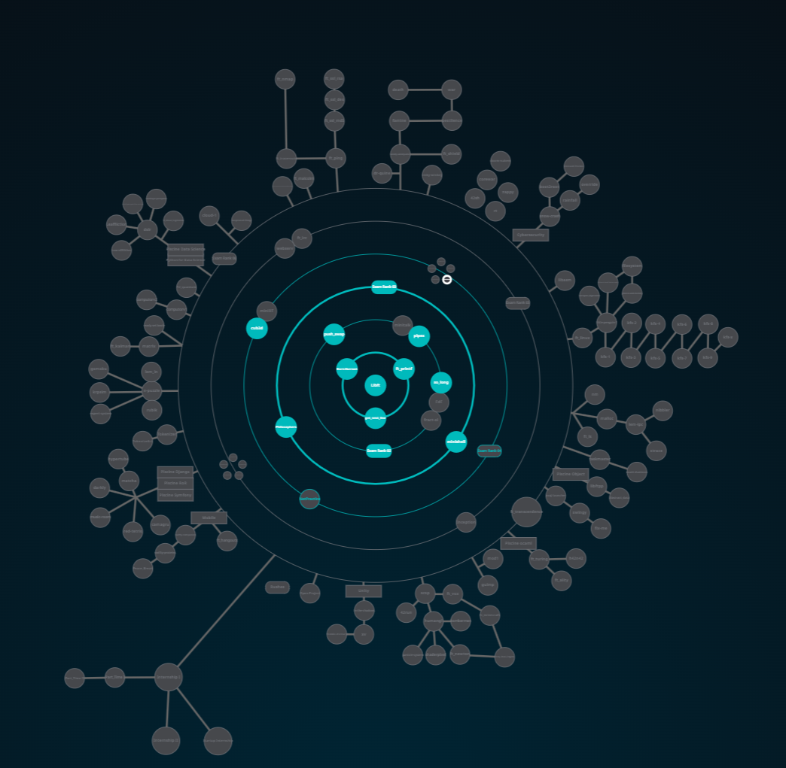

        ██╗  ██╗██████╗      ██████╗██╗   ██╗██████╗ ███████╗██╗   ██╗███████╗
        ██║  ██║╚════██╗    ██╔════╝██║   ██║██╔══██╗██╔════╝██║   ██║██╔════╝
        ███████║ █████╔╝    ██║     ██║   ██║██████╔╝███████╗██║   ██║███████╗
        ╚════██║██╔═══╝     ██║     ██║   ██║██╔══██╗╚════██║██║   ██║╚════██║
             ██║███████╗    ╚██████╗╚██████╔╝██║  ██║███████║╚██████╔╝███████║
             ╚═╝╚══════╝     ╚═════╝ ╚═════╝ ╚═╝  ╚═╝╚══════╝ ╚═════╝ ╚══════╝

---

42 is self-taught programming school founded by Xavier Niel in France. The school stands out for its unique pedagogical approach, which is based on peer-to-peer learning, project-based and gamification.

# 🗺️ My progress



# ⬇️ Download

1. Download repo
```bash
git clone --recursive git@github.com:alexhiguera/42Cursus.git
```   
2. Submodules
```bash
git submodule update --init --recursive
```
---
# 🏗️ Proyectos
## 0️⃣ Milestone

📁 **[Libft](https://github.com/alexhiguera/Libft/tree/main)**

## 1️⃣ milestone


📁 **[Printf](https://github.com/alexhiguera/printf/tree/main)**

📁 **[Born2beroot](3_Born2beroot)**

📁 **[GNL](https://github.com/alexhiguera/Get_Next_Line/tree/main)**

## 2️⃣ Milestone


📁 **[Pipex](https://github.com/alexhiguera/Pipex/tree/main)**

📁 **[So_long](https://github.com/alexhiguera/So_long/tree/main)**

📁 **[Push_swap](https://github.com/alexhiguera/Push_swap/tree/main)**

## 3️⃣ Milestone

📁 **[Philosophers](https://github.com/alexhiguera/Philosophers/tree/main)**

📁 **[Minishell](https://github.com/alexhiguera/minishell/tree/main)**

## 4️⃣ Milestone

📁 **[Cub3d](https://github.com/alexhiguera/42cub3d/tree/main)**

📁 **[Cpp 01](https://github.com/alexhiguera/cpp_1/tree/main)**

<!--
## 5️⃣ Milestone
## 6️⃣ Milestone
-->
---

## 📌 Note: update submodules:
```bash
git submodule foreach git pull origin main
```

¡Dont copy! 🚀